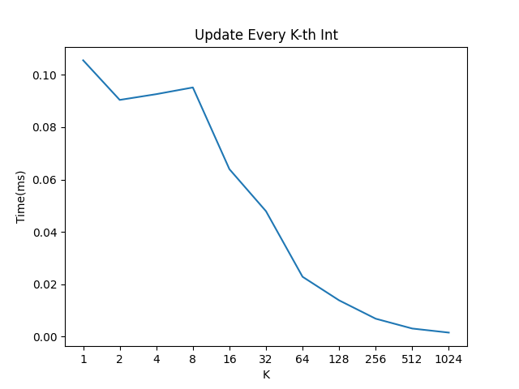
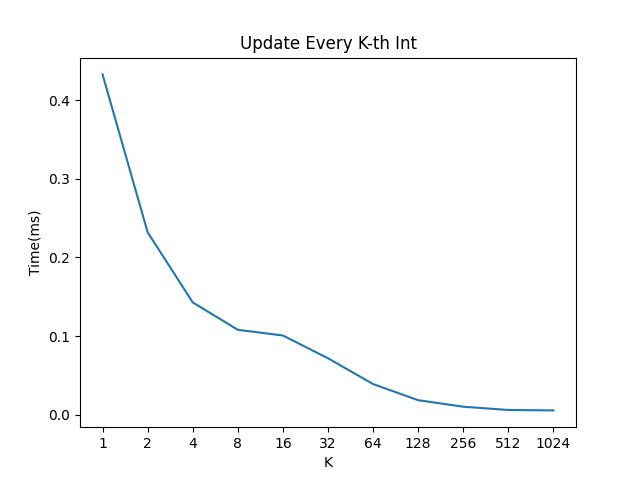

[](https://pubsonline.informs.org/journal/opre)

# CacheTest

This archive is distributed in association with the journal [Operations Research](https://pubsonline.informs.org/journal/opre) under the [MIT License](LICENSE).

The software and data in this repository are a snapshot of the software and data
that were used in the research reported on in the paper 
[This is a Template](https://doi.org/10.1287/opre.2024.0000) by T. Ralphs. 
The snapshot is based on 
[this SHA](https://github.com/tkralphs/ORJournalTemplate/commit/7588d8908e79fd1b30a933d3553ebf18bb906bb9) 
in the development repository. 

**Important: This code is being developed on an on-going basis at 
https://github.com/tkralphs/ORJournalTemplate. Please go there if you would like to
get a more recent version or would like support**

## Cite

To cite the contents of this repository, please cite both the paper and this repo, using their respective DOIs.

https://doi.org/10.1287/opre.2024.0000

https://doi.org/10.1287/opre.2024.0000.cd

Below is the BibTex for citing this snapshot of the respoitory.

```
@article{CacheTest,
  author =        {T. Ralphs},
  publisher =     {Operations Research},
  title =         {{CacheTest}},
  year =          {2024},
  doi =           {10.1287/opre.2024.0000.cd},
  url =           {https://github.com/ORJournal/2024.0000},
}  
```

## Description

The goal of this software is to demonstrate the effect of cache optimization.

## Building

In Linux, to build the version that multiplies all elements of a vector by a
constant (used to obtain the results in [Figure 1](results/mult-test.png) in the
paper), stepping K elements at a time, execute the following commands.

```
make mult
```

Alternatively, to build the version that sums the elements of a vector (used
to obtain the results [Figure 2](results/sum-test.png) in the paper), stepping K
elements at a time, do the following.

```
make clean
make sum
```

Be sure to make clean before building a different version of the code.

## Results

Figure 1 in the paper shows the results of the multiplication test with different
values of K using `gcc` 9.4 on an Ubuntu Linux box.



Figure 2 in the paper shows the results of the sum test with different
values of K using `gcc` 9.4 on an Ubuntu Linux box.



## Replicating

To replicate the results in [Figure 1](results/mult-test.png), do either

```
make mult-test
```
or
```
python scripts/test.py mult
```
To replicate the results in [Figure 2](results/sum-test.png), do either

```
make sum-test
```
or
```
python scripts/test.py sum
```

## Ongoing Development

This code is being developed on an on-going basis at the author's
[Github site](https://github.com/tkralphs/ORJournalTemplate).

## Support

For support in using this software, submit an
[issue](https://github.com/tkralphs/ORJournalTemplate/issues/new).
